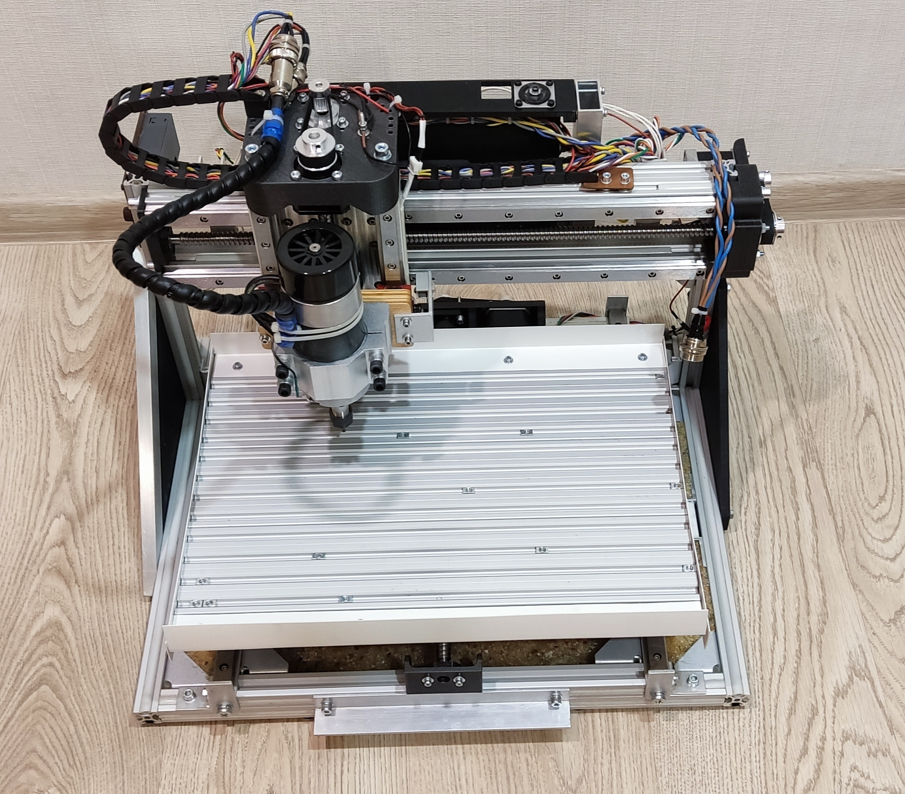
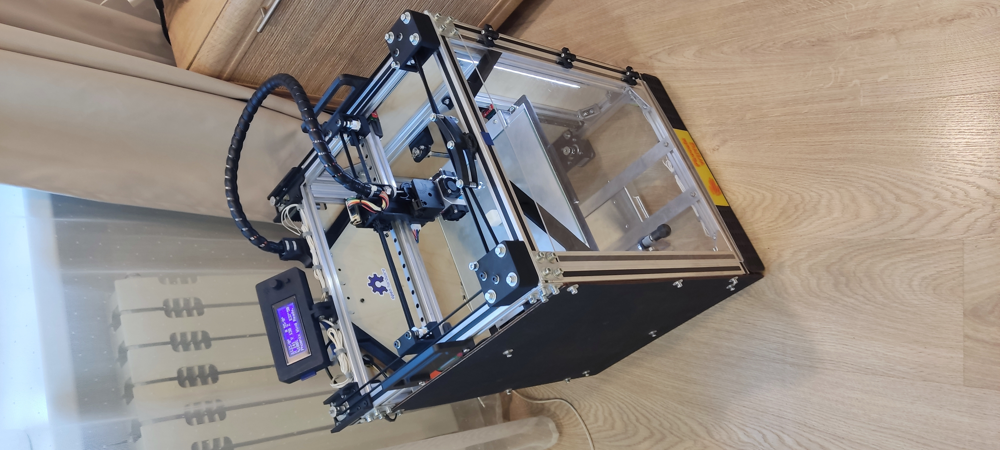
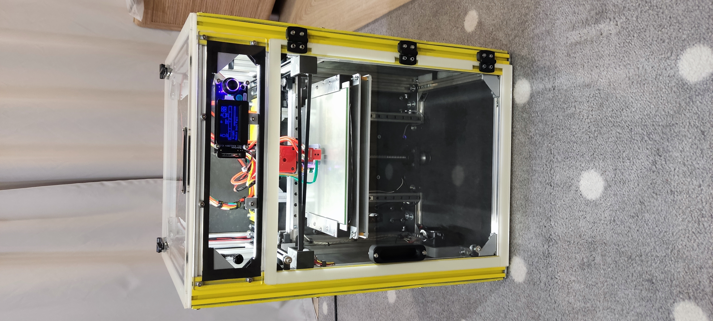
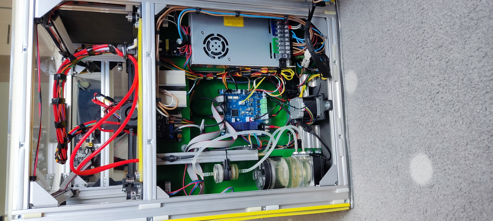
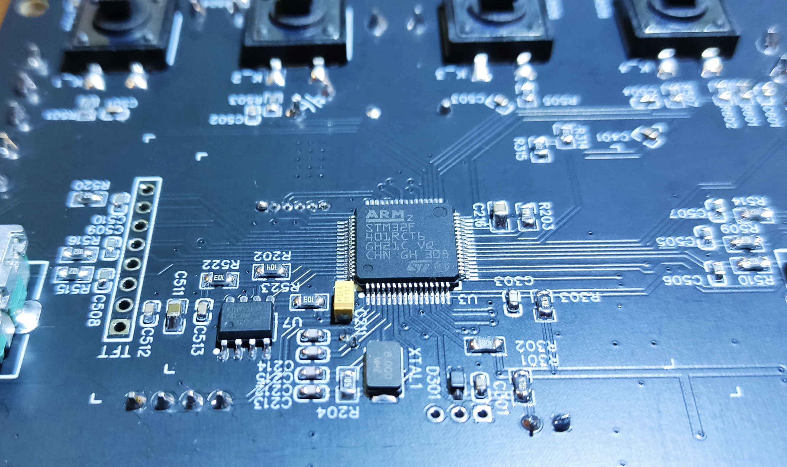
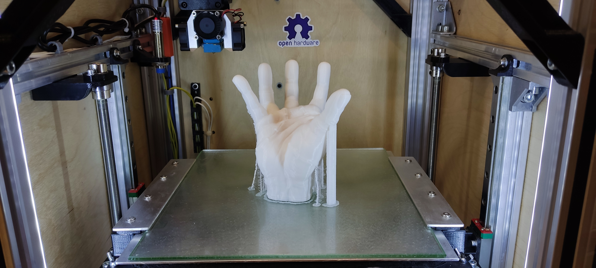

Hello everyone, my name is Pavel "Am0k" Kolesov.
## My hobbies:

- microelectronics, circuit engineering, including the creation of embedded systems based on AVR, ARM and ESP microcontrollers (project, firmware, implementation in hardware);

  
  

- creation of CNC machines (for milling, 3D printing);

  
  
  

- creation of automated control systems (thermal controllers, time relays, humidity and lighting regulators);

  

- actual 3D printing.

  

